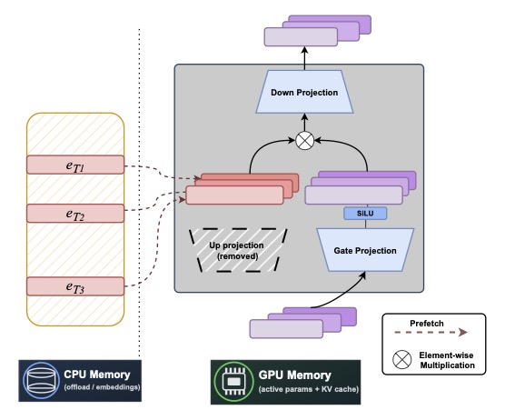
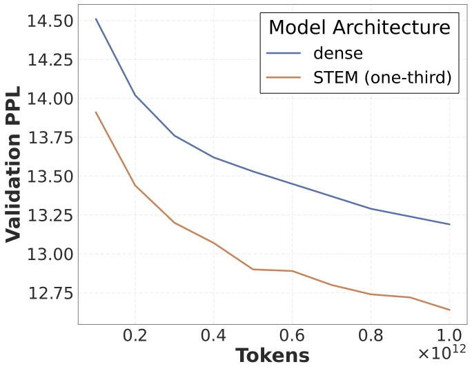
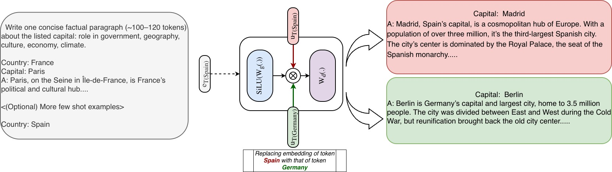

# STEM: Scaling Transformers with Embedding Modules

Ranajoy Sadhukhan, Sheng Cao, Harry Dong, Changsheng Zhao, Attiano Purpura-Pontoniere, Yuandong Tian, Zechun Liu*, Beidi Chen*.

This repository is an implementation of STEM. The training scripts are built on top of Meta Lingua which is a minimal and fast training library. Unlike standard transformer with gated FFNs, STEM replaces the up-projection matrix multiplication in each FFN layer with a token-indexed embedding lookup table. STEM provides improved ***knowledge storage capacity***, ***interpretability***, and ***efficiency*** in both training and inference. 

<p align="center">
<table>
<tr style="vertical-align: top;">
<td width="48%">

</td>
<td width="4%"></td>
<td width="48%">

</td>
</tr>
</table>
</p>
<p align="center">  
 
</p>

## Quick start

The following commands launch a SLURM job that creates an environment for Meta Lingua.
The env creation should take around 5 minutes without counting downloads. 

```bash
git clone https://github.com/facebookresearch/STEM
cd STEM

bash setup/create_env.sh
# or if you have access to a SLURM cluster
sbatch setup/create_env.sh
```
Once that is done your can activate the environment 
```bash
conda activate lingua_<date>
```
use the provided script to download and prepare data from huggingface (among `fineweb_edu`, `fineweb_edu_10bt`, or `dclm_baseline_1.0`).
This command will download the `fineweb_edu` and prepare it for training in the `./data` directory, specifying the amount of memory `terashuf` (the tool used to shuffle samples) will be allocated. By default, the number of chunks (`nchunks`) is 32. If you are running on fewer than 32 GPUs, it is recommended to set `nchunks` to 1 or to match `nchunks` with the number of GPUs (`nchunks` = NGPUs). See [here](https://github.com/facebookresearch/lingua/issues/55#issuecomment-2483643076) for more details.
```bash
python setup/download_prepare_hf_data.py fineweb_edu <MEMORY> --data_dir ./data --seed 42 --nchunks <NCHUNKS>
```
to download tokenizer (here llama3), use the folowing script:
```bash
python setup/download_tokenizer.py llama3 <SAVE_PATH> --api_key <HUGGINGFACE_TOKEN>
```
Now launch a debug job to check if everything works.  **The provided configurations are templates, you need to adapt them for them to work (change `dump_dir`, `data.root_dir`, `data.tokenizer.path`, etc ...)**

```bash
# stool stands for SLURM tool !
python -m lingua.stool script=apps.main.train config=apps/main/configs/debug.yaml nodes=1 partition=<partition>
# if you want to launch locally you can use torchrun
torchrun --nproc-per-node 8 -m apps.main.train config=apps/main/configs/debug.yaml
# or you can also launch on 1 GPU
python -m apps.main.train config=apps/main/configs/debug.yaml
```

When using `stool`, if a job crashes, it can be relaunched using sbatch:
```bash
sbatch path/to/dump_dir/submit.slurm
```

To launch a debug job with the STEM architecture locally using 8 GPUs, use the following command
```bash
torchrun --nproc-per-node 8 -m apps.main.stem_train config=apps/main/configs/stem_debug.yaml
```

## Training Results 

Performance improvements with STEM at different model scales.

### Pretraining results

### 350M model with 100B training tokens
| name           | total params (B) | active params (B) | arc_challenge | arc_easy | boolq |  piqa | siqa | hellaswag |  obqa | winogrande |  average  |
|----------------|:-------------:|:-------------:|:-------------:|:--------:|:-----:|:-----:|:---------:|:-----:|:-----:|:-----:|:----------:|
| Baseline |     0.37     |   0.37  | 57.66 | 30.55 | 58.20 | 69.42 | 41.10 | 49.68 | 34.80 | 56.35 | 49.72 |
| STEM (1/3 layers) | 1.14 | 0.35 | 63.01 | 32.68 | 60.31 | 70.18 | 39.76 | 52.38 | 33.00 | 55.88 | 50.90 |
| STEM (1/2 layers) | 1.85 | 0.34 | 62.95 | 40.00 | 62.02 | 70.94 | 43.70 | 51.49 | 46.68 | 55.78 | 54.20 |
| STEM (all layers) | 3.25 | 0.30 | 62.21 | 39.61 | 61.99 | 70.73 | 43.60 | 48.44 | 44.53 | 56.33 | 53.43 |


### 1B models with 1T training tokens

| name           | total params (B) | active params (B) | arc_challenge | arc_easy | boolq |  piqa | siqa | hellaswag |  obqa | winogrande |  average  |
|----------------|:-------------:|:-------------:|:-------------:|:--------:|:-----:|:-----:|:---------:|:-----:|:-----:|:-----:|:----------:|
| Baseline |     1.50  |  1.50  | 66.98 | 41.88 | 64.21 | 73.44 | 44.09 | 59.65 | 39.84 | 56.48 | 55.82 |
| STEM | 6.75  |  1.41  | 65.95 | 42.03 | 61.66 | 75.00 | 44.78 | 60.37 | 45.90 | 57.34 | **56.63** |

### Midtraining results
| name           | arc_challenge | arc_easy | boolq |  piqa | siqa | hellaswag |  obqa | winogrande |  average  | GSM8k | MMLU |
|----------------|:-------------:|:-------------:|:-------------:|:--------:|:-----:|:-----:|:---------:|:-----:|:-----:|:-----:|:----------:|
| Baseline |     70.78 | 42.11 | 65.84 | 72.95 | 47.13 | 60.39 | 42.97 | 57.81 | 57.50 |  44.2  |  29.92  |
| STEM | 69.78 | 44.22 | 68.54 | 74.69 | 45.65 | 61.90 | 45.70 | 57.42 | **58.49** |  **46.4**  |  **32.38** | 

## Project overview

STEM is structured as follows:

```
📦STEM
 ┣ 📂lingua # Core library
 ┃ ┣ 📜args.py
 ┃ ┣ 📜checkpoint.py
 ┃ ┣ 📜data.py
 ┃ ┣ 📜distributed.py
 ┃ ┣ 📜float8.py
 ┃ ┣ 📜logger.py
 ┃ ┣ 📜metrics.py
 ┃ ┣ 📜optim.py
 ┃ ┣ 📜probe.py
 ┃ ┣ 📜profiling.py
 ┃ ┣ 📜stool.py
 ┃ ┣ 📜tokenizer.py
 ┃ ┣ 📜transformer.py
 | ┣ 📜stem.py 
 ┃ ┣ 📜stem_dist_utils.py
 ┃ ┗ 📜stem_checkpoint.py
 ┣ 📂setup
 ┃ ┣ 📜create_env.sh
 ┃ ┗ 📜download_prepare_hf_data.py
 ┗ 📂apps # Apps that put components together
   ┗ 📂main # Main language modeling app with llama
     ┣ 📂configs
     ┣ 📜eval.py
     ┣ 📜generate.py
     ┣ 📜train.py
     ┣ 📜transformer.py
     ┣ 📜stem.py 
     ┗ 📜stem_train.py 
```

The `lingua` folder contains some essential and reusable components, while the `apps/main` folder contains scripts that put those components together. We add support for STEM modifications in these two folders. 
> Note, STEM embedding tables have large memory footprints as each embedding table has size `vocab size x intermediate size`. So we split the embedding tables in each layer along the embedding dimension axis in multi GPU training. However, the backbone of the model can be flexibly parallelized using replication based DDP, FSDP or model parallel techniques. 

> For larger models, we can further optimize the implementation by offloading the STEM embedding tables and the corresponding optimizer states to CPU. For additional speedup, we can maintain an LFU cache to store the most commonly used embeddings and their optimizer states. We leave this implementation for the future.


Here's a quick description of the most important files and features:

- **`transformer.py`** : Defines standard transformer architecture. 
- **`distributed.py`** : Handles distributing the model on multiple GPUs. This is done through `parallelize_module` function which wraps your vanilla `nn.Module` and applies nearly any combination of Data Parallel, Fully Sharded Data Parallel, Model Parallelism, `torch.compile`, activation checkpointing and `float8`. 
- **`data.py`** : Dataloader for LLM pretraining.

<p align="center">  
 
</p>

- **`profiling.py`** : Small wrapper around xformers' profiler which provides automatic MFU and HFU calculation and dumps profile traces in profiling folder in your dump directory. It also has memory profiling trace. 
- **`checkpoint.py`** : Manages model checkpoints. It saves model in checkpoints folder in your dump dir in .distcp format which is the new PyTorch distributed saving method. This format allows to reload the model with a different number of GPUs and with a different sharding. You can also convert those into normal PyTorch checkpoints with `torch.distributed.checkpoint.format_utils.dcp_to_torch_save` and the other way around `torch_save_to_dcp`.
- **`args.py`** : Utilities to work with configs. 

We always use parallel embedding for STEM embeddings to reduce memory overhead. Here are the additional files to support STEM architecture.

- **`stem.py`** : Defines the backbone architecture of STEM-based model.
- **`stem_dist_utils.py`** : Custom parallelization for the STEM embedding tables.
- **`stem_checkpoint.py`** : Customized checkpoint for saving the sharded STEM embedding tables.

We also add the following scripts in `apps/main` folder to support STEM.

- **`stem.py`** : Combines the STEM model backbone defined in `lingua/stem.py` with layerwise STEM embedding tables.
- **`stem_train.py`** : training script for STEM-based model.


## Configuration

Most components need configuration and we chose to use data classes to represent these configuration objects. `args.py` helps with converting between `config.yaml` and config dictionaries into the respective data classes. 

So for examples the `TrainArgs` in `apps/main/train.py` has a `LMTransformerArgs`, `OptimArgs`, etc ... as children. 

Here is an example configuration file that will be converted to `TrainArgs`:

```yaml
# This is where Meta Lingua will store anything related to the experiment. 
dump_dir: /path/to/dumpdir
name: "debug"
steps: 1000

seed: 12

optim:
    lr: 3e-4
    warmup: 2000
    lr_min_ratio: 0.000001
    clip: 10.0

distributed:
    fsdp_type: full_shard
    compile: true
    selective_activation_checkpointing: false

model:
    dim: 1024
    n_layers: 8
    n_heads: 8

data:
    root_dir: data/shuffled
    sources:
      wikipedia: 80.0
      arxiv: 20.0
    batch_size: 32
    seq_len: 1024
    load_async: true
    tokenizer:
        name: sp
        path: tokenizers/llama2.model
```

For STEM-based model, we need to use additional hyperparameters such as,

```yaml
model:
    stem_layers: [1, 3, 5, 7]   # which layers to use STEM modification in

distributed:
    stem_parallel_size: 8       # the number of shards the STEM embeddings are split into
```

## Evaluations

Evaluations can run either during training periodically or you directly launch evals on a given checkpoint as follows:

```bash
srun -n 8 python -u -m apps.main.eval config=apps/main/configs/eval.yaml
```

You need to specify the checkpoint and dump dir of the evaluation in that config

Or through `stool` with

```bash
python -m lingua.stool script=apps.main.eval config=apps/main/configs/eval.yaml nodes=1 account=fair_amaia_cw_codegen qos=lowest
```

## Dump dir structure

```
📂example_dump_dir
 ┣ 📂checkpoints
 ┃ ┣ 📂0000001000
 ┃ ┣ 📂0000002000
 ┃ ┣ 📂0000003000
 ┃ ┣ 📂0000004000
 ┃ ┣ 📂0000005000
 ┃ ┣ 📂0000006000
 ┃ ┣ 📂0000007000 # Checkpoint and train state saved every 1000 steps here
 ┃ ┃ ┣ 📜.metadata
 ┃ ┃ ┣ 📜__0_0.distcp
 ┃ ┃ ┣ 📜__1_0.distcp
 ┃ ┃ ┣ 📜params.json
 ┃ ┃ ┣ 📜train_state_00000.json
 ┃ ┃ ┗ 📜train_state_00001.json
 ┃ ┗ 📂stem_shards # custom storage scheme for dimension parallel stem embedding tables
 ┃ ┃ ┣ 📜stem_model_mp0.pt
 ┃ ┃ ┣ 📜stem_optim_mp0.pt
 ┃ ┃ ┣ 📜stem_model_mp1.pt
 ┃ ┃ ┗ 📜stem_optim_mp1.pt
 ┣ 📂code # Backup of the code at the moment the job was launched
 ┣ 📂logs
 ┃ ┗ 📂166172 # Logs for each GPU in this SLURM job.
 ┃ ┃ ┣ 📜166172.stderr
 ┃ ┃ ┣ 📜166172.stdout
 ┃ ┃ ┣ 📜166172_0.err
 ┃ ┃ ┣ 📜166172_0.out
 ┃ ┃ ┣ 📜166172_1.err
 ┃ ┃ ┗ 📜166172_1.out
 ┣ 📂profiling
 ┃ ┣ 📂memory_trace_plot # Trace of memory usage through time for all GPUs
 ┃ ┃ ┣ 📜000102_h100-192-145_451082.html
 ┃ ┃ ┣ 📜000102_h100-192-145_451083.html
 ┃ ┗ 📂profile_CPU_CUDA_000104 # Profiling traces for all GPUs
 ┃ ┃ ┣ 📜h100-192-145_451082.1720183858874741723.pt.trace.json.gz
 ┃ ┃ ┗ 📜h100-192-145_451083.1720183858865656716.pt.trace.json.gz
 ┣ 📜base_config.yaml
 ┣ 📜config.yaml
 ┣ 📜metrics.jsonl
 ┗ 📜submit.slurm
```


## Citation

<!-- ```
@misc{meta_lingua,
  author = {Mathurin Videau and Badr Youbi Idrissi and Daniel Haziza and Luca Wehrstedt and Jade Copet and Olivier Teytaud and David Lopez-Paz},
  title = {{Meta Lingua}: A minimal {PyTorch LLM} training library},
  url = {https://github.com/facebookresearch/lingua},
  year = {2024}
}
``` -->
## License

STEM is licensed under BSD-3-Clause license. Refer to the LICENSE file in the top level directory.
